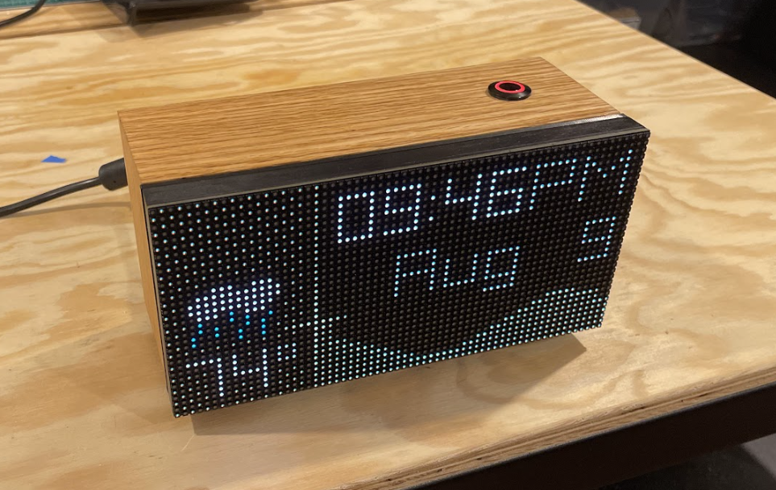

# LED Matrix Clock
An clock which displays on a 64x32 LED display. Shows the current time, date, weather, and next 24 hours of temperature.

I built the graphics using Raylib (https://www.raylib.com/), and weather information is queried from the weather.gov/NOAA weather API.

YouTube video with a walkaround of the project: https://www.youtube.com/watch?v=OrP6YSjuHTE.

## (Incomplete) parts list
- Raspberry Pi 3B: https://www.raspberrypi.com/products/raspberry-pi-3-model-b/
- Adafruit RGB Matrix HAT: https://www.adafruit.com/product/2345
- Adafruit 64x32 RGB LED Matrix: https://www.adafruit.com/product/2279

## Software dependencies
- raylib: https://www.raylib.com/
- rpi-rgb-led-matrix: https://github.com/hzeller/rpi-rgb-led-matrix
- wiringpi: http://wiringpi.com/

